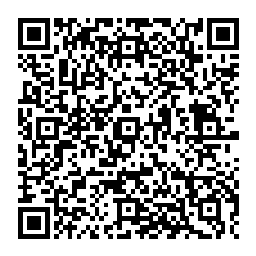

# Gerador Pix
Gerador Pix Copia e Cola em Golang

Fiz este gerador para um projeto pessoal, talvez eu transforme em um pacote no futuro.

Fique a vontade para modificar para suas necessidades.


```golang
var pix = Pix{
	Key:         "73ea37f3-ad17-4a5d-8ee4-f55a5bc5c359",
	Amount:      1.5,
	Description: "Faz um pix ai pia!",
	TxId:        "<transaction_id>",
	Merchant: Merchant{
		Name: "Wagner", 
		City: "Curitiba",
	},
}

log.Println(pix.GetPayload())
```
Escaneie o qrcode abaixo para testar

